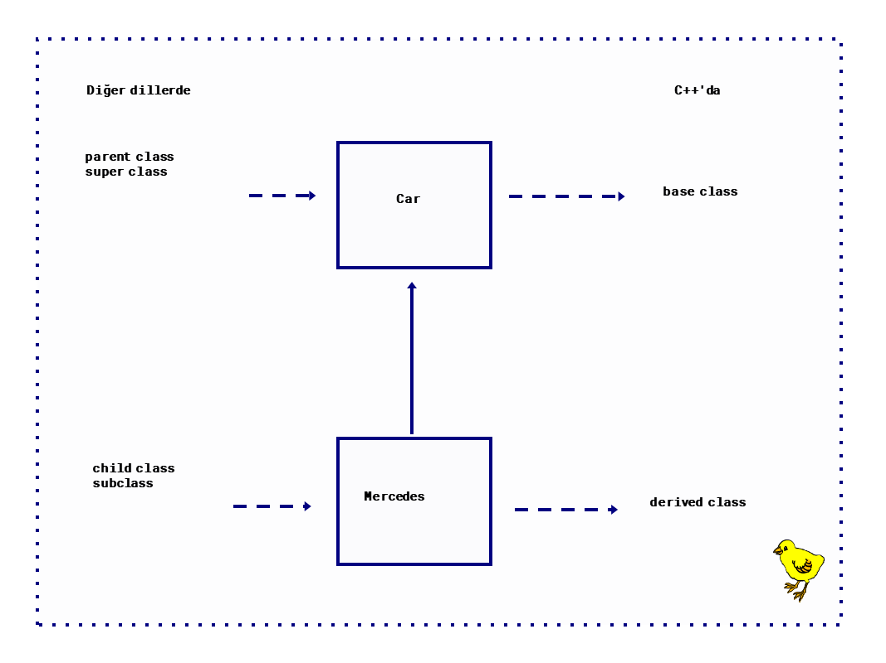
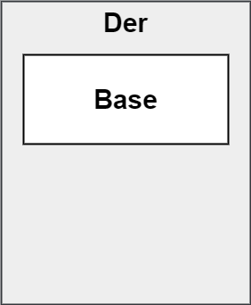
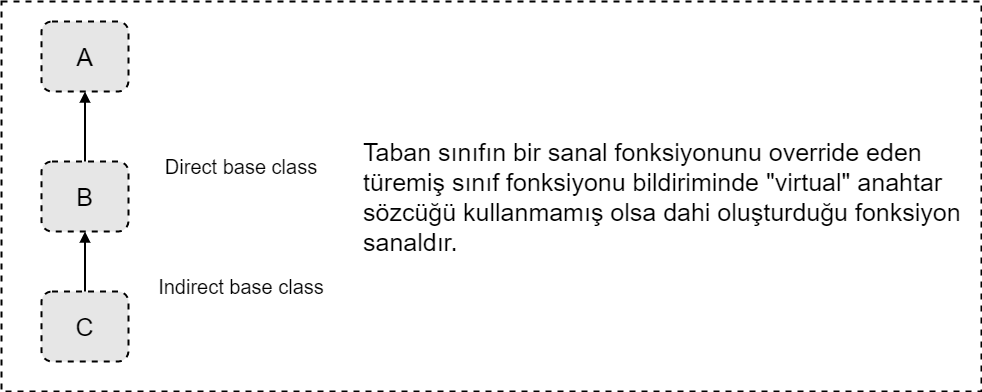
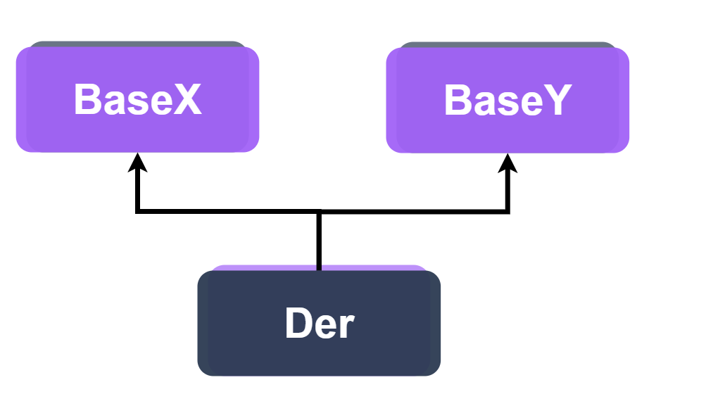
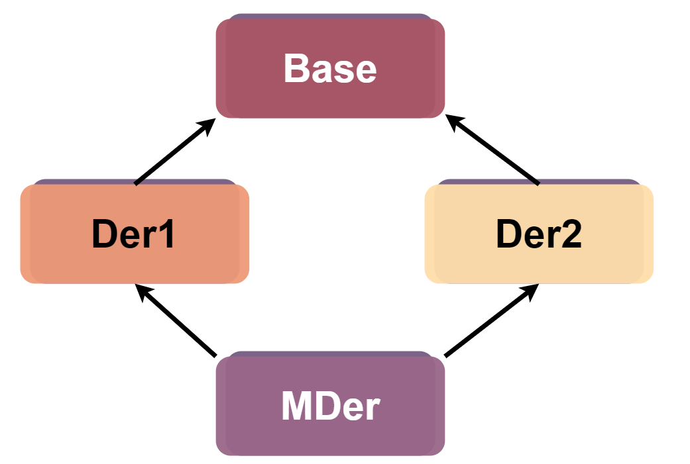
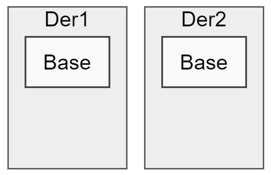

<!--
    Example 
    * italic sentences *
    --- lines
    - item
    * item
    + item
    <website https//....>
    [Code](#Value-Category) just example

    You can do blocks of code by surround it with 3 backticks()
    ```

    <style>
    p {
        color: orange
    }
    </style>
-->

## Reference

```txt
              expression
               /     \ 
              /       \
             /         \
        glvalue       rvalue
          / \          / \
         /   \        /   \
        /     \      /     \
    lvalue     xvalue     prvalue
```

#### Value Category

- RValue

- LValue

#### Type Category

- RValue reference

- LValue reference

**Rvalue:** Taşınabilir fakat bellekte herhangi bir adresi yok.

__Lvalue:__ İsim formundaki yani bellekte yer tutan nesnelerin değer kategorisidir.

> Bir sol taraf referansı bir "sağ taraf değeri" ifadesine bağlanamaz.

> Bir sağ taraf referansı bir "sol taraf değeri" ifadesine bağlanamaz. Fakat const sol taraf referansı "sağ taraf değeri" ifadesine bağlanabilir.

> Sol taraf referansları ilk değer ile başlatılmak zorundadır.

```C++
int x = 10;
int& r = x; 
```

> Referanslar rebindable değildir. "T* const ptr" gibidirler.

```C++
int x = 10;
int y = 5;
int& r = x;
r = y; //Error refrence not rebindable
```

> Bir sol taraf referansı bir "sağ taraf değeri" ifadesine 
bağlanamaz.
````C++
int& r = 10; //Error Lvalue reference can not bind rvalue
````

> Bir const sol taraf referansı bir "sağ taraf değeri" 
ifadesine bağlanabilir.

> İsim formundaki tüm ifadelerin değer kategorisi Lvalue
expersion'dır.


```C++
int  foo();
int& func();
int main() {
    int& a = func(); // valid
    int b = foo();   // valid
    int& c = func(); // invalid(Lvalue ref. can't bind r value)
    const int& d = foo(); //valid. [*]
}
```

`const int& d = foo()` şeklinde belirtilen kodun geçerli olmasının sebebi compiler `const int temp = foo();` şekilinde bir kod üretir ve daha sonra `const int& d = temp` olarakoluşturul    böylece lvalue referans sol değer ifadesinebağlanır. 

> Bir ifadenin data type başka value category'si başkadır.
````C++
int&& ref = 10;
//ref ---> isim formu olduğu için L value expr.
//data type ise sağ taraf referansıdır.(RValue reference)
````

> const lvalue reference tipinde bir değişkene sağ taraf değeri ile ilk değer vermenin en önemli kullanımı move schematic'tir. Sınıf yapılarında bunu tekrar inceleyeceğiz.

```C++
double dval{2.456};
const int& x = dval; //valid
const int& y(dval); //valid
const int& z{dval}; //invalid. Narrowing conservion
```

- `int x(10);` &#8594; direct initialization
- `int x{};`   &#8594; value, uniform, bracet initialization
- `int x{10};` &#8594; direct list initialization

**Uniform initialization neden eklendi?**
1. Neye ilk değer verirsen ver her zaman kullanılabilir.
1. Narrowing conversion durumunu engellemek için.
1. Most vexing parse(Scott Meyers tarafından dile ekledi)

__Most vexing parse__
```C++
#include <iostream>

struct A {

};

struct B {
    B(A) {
        std::cout << "B constructor\n"; 
    }
};

int main() {
    B b(A()); //function decleration
}
```
Yukarıdaki örnekte derleyici nesne bildirimi yerine önceliği fonksiyon bildirimine verir. Tipik bir `most verxing parse` örneğidir. Fakat `B b{A()}`şeklinde olsaydı bu bir nesne bildirimi olacak ve standart outputa ***B constructor*** yazacaktı. 

---


## Auto Type Deduction

**Acronym:** Kelimelerin baş harfleriyle oluşturulur.

* AAA --> Almost Always Auto

* VIP --> Very Important Person

Auto aşağıdaki şekillerdeki gibi kullanılabilir.
````C++
auto x = expr;
auto& x = expr;
auto&& x = expr;
````

Aşağıdaki şekilde kullanılması durumda eğer reference ve const varsa her ikiside düşer.
```C++
const int x = 10;
auto y = x; // int y = x;

int& r = x;
auto y2 = r; // int y2 = r;

const int& z = x;
auto y3 = z; // int y3 = z;
```
> __İstisna:__ `auto p = "enes";` ilk değer verme kullanılması durumunda derleyici `const char* temp = "enes";` şeklinde bir kod üretir. Daha sonra [auto](#Auto-Type-Deduction) ifadesi yerine `const char* p = temp` gelecektir. 

Reference ile kullanılması durumda
```C++
int x = 10;
int& r = x;
auto& y = r; // int& y = r;

const int& r2 = x;
auto& y2 = r2; // const int& y2 = x;
```

Son olarak `auto&& x = expr` için aşağıdaki durumların olması durumu sırası ile inceleyelim.

- İlk değer veren ifade pr value expression ise,

- İlk değer veren ifade r value expression ise,

- İlk değer veren ifade x value expression ise

| expr |  auto  | çıkarım(x) |
| -- | --- | -- |
| T& |  &  | T& |
| T& |  && | T& |
| T&& |  &  | T& |
| T&& |  &&  | T&& |

__NOT:__ Basit olarak çıkarımı şu şekilde yapabiliriz. Eğer `expr` sol taraf ifadesi ise `x` sol taraf referansı, eğer `expr` sağ taraf ifadesi ise `x` sağ taraf referansı olacaltır.

```C++
int y = 10;
auto&& r = 10; // sağ taraf ifadesi bu yüzden int&& r = 10 olacaktır.
auto&& r2 = y; // sol taraf ifadesi bu yüzden int& r2 = y; olacaktır.
```

Eğer ki `auto&&` bir sol taraf ifadesine bağlanılması durumunda `T& &&` çıkarımı yapılır. Burada referans bozulması(reference collapsing) olur. Böylece reference düşer `T&`şeklini alır.


---

## Decltype

Eğer decltype operatörünün operandı olan ifade bir isim
formunda değil ise ifadenin value kategorisine bakılacak.

- İfade Lvalue ise elde edilen tür  __T &__

- İfade PRvalue ise elde edilen tür __T__

- İfade Xvalue ise elde edilen tür  __T &&__

---

## constexpr

En önemli kullanımı fonksiyonların geri dönüş değeri 
olarak kullanımıdır.

````C++
constexpr int sum_square(int a, int b)
{
    return a*a + b*b;
}
int main() {
int x = 5, y = 4;
sum_square(x,y); // Geçerli
constexpr int z = sum_square(x,y); //Geçersiz
}
````
__Sum_square__ fonksiyonunun operandına sabit olmayan
değişkenler girildiğinde normal bir fonksiyon gibi davranır.
Yani run time'da çalışır. Bu yüzden "constexpr int z" sadece
sabit bir ifade ile başlayacağından geçersiz olacaktır.

> constexpr fonksiyonlar başlık dosyalarında implicit inline
olarak tanımlanır.

---

## Function Overloading

Aynı isimli işlevler aynı kapsamda(scope) olmalıdır.
Aynı kapsamdaki aynı isimli işlevlerin imzaları farkı olacak.

#### Function Redeclaretion
```C++
void func(int a, int b);
void func(int, int);
```

#### Syntax Error
```C++
void func(int a, int b);
int func(int, int);
```

#### Function Overloading
```C++
void func(int a, int b);
void func(int);
```

1. **Variadic conversion**

__İstisna:__ C'de variadic fonksiyonlar sadece *elipsis(...)* kullanılarak tanımlanamaz. C++ bu gerçerlidir.

```C++
//variadic func.
void func(...); // 1
void func(int x, ...); // 2
void func(int x, int y, ...); // 3

int main()
{
    funcR(1,2,3,4,5); // 3 çağrılır.
}
```

2. **User-defined Conversion**

    Programlayıcı tarafından tanımlanan dönüşümlere denir.
    ```C++
    struct Data  {
        Data() = default;
        Data(int);
    }
    int main() {
        Data mydata;
        mydata = 10; //user-defined type
    }
    ```

3. __Standard Convertion__

    - int    &#8594; double
    
    - double &#8594; int
    
    - double &#8594; char
    
    - enum   &#8594; int
    
    - int*   &#8594; void*
    
    gibi bazı dönüşümler derleyicinin implicitly     dönüşümlerine örnektir.
    
    ```C++
    void func(int);    // 1
    void func(double); // 2
    void func(char);   // 3
    int main() {
        func(12.f); // 2
    }
    ```
    > **func(double)** çağrılacaktır. Çünkü float'tan double'a promotion vardır.

<!--
-->

1. exact match(tam uyum)

2. promotion(terfi-yükseltme)

3. conversion

Yukarıdaki 3 durum içerisinde fonksiyon sırası ile uygun olan fonksiyonu derleyici arar.(exact match > promotion > convertion)

Eğer ki exact match yok ise promortion'a bakılır o da yok ise conversiona bakılır. Eğer ki birden fazla aynı işlevde conversion olacak fonksiyon varsa ambiguity olur.

### Exact-Match
- LValue to rvalue conversion

- T* to const T* conversion

- Function to pointer conversion 

exact match'tir.

Örneğin;
```C++
void func(int a);
int main() {
    int x = 10;
    func(x); //Lvalue to rvalue exact-match olacktır.
}
```

### Promotion

- Integral promotion

    int'ten küçük türlerden int türüne yapılan dönüşeme denir.

    - char &#8594; int
    - signed char &#8594; int
    - unsigned char &#8594; int
    - bool &#8594; int
    - signed short &#8594; int

float &#8594; double

__C ve C++ dillerinde__

1. Fonksiyonların parametre değişkenleri dizi (array) olmaz.
2. Fonksiyonların geri dönüş değer türleri dizi(array) olmaz.

```C++
//function redecleration
void func(int);
void func(const int);
```
**const overloading**
```C++
 //function overloading
 void func(int*);
 void func(const int*);
```

---

<br></br>

## Numaralandırma Türleri

#### Enum:

> C'den farklı olarak underlying type vardır.

Enum'larda underlying(base) type sabit değildir. Böylece enumların temel tipi bir `implementation defined integral type`'dır.

```C++
enum Color : char {
WHITE,
GREEN,
RED,
BLACK
};
```
#### Enum classes:
> Underlying type vardır.

> Forward decleration vardır.

```C++
enum class Color : char;
```

[Enum class](#Enum-classes) 'ların avantajları;

- Underlying type
- Implicit cast yok
- Scope resolution var

```C++
enum class Color {
    White,
    Black,
    Green,
    //...
};
int main() {
    Color mycolor = White; //Geçersiz çünkü white, enum Color kapsama alanında
    Color mycolor = Color::White; // Geçerli
}
```

---

## Tür Dönüşüm Operatörleri:

- static_cast
- const_cast
- reinterpret_cast
- dynamic_cast

#### C-style casting
Tüm cast işlemlerinde `()` parantez operandı içerisinde hedef tip belirtilerek yapılır(`(type target)expr`).

````C++
//C style casting
const int x = 10;
int* ptr = (int*)&x;
*ptr = 48; //Valid but undefined behaviour
````

#### static_cast
-  int*'dan void*'a implicit type conversion vardır.

- int*'dan void*'a veya void*'dan int*'a hem static_cast hem de reinterpret_cast kullanılabilir.

````C++
int x = 10;
void* sptr = static_cast<void*>(&x);
void* rptr = reinterpret_cast<void*>(&x);
````

#### const_cast
````C++
const int x = 10;
int* ptr = const_cast<int*>(&x);
*ptr = 48; //Valid but undefined behaviour
````
C'de kullanılan `strchr` fonksiyonu buna en güzel örnek olabilir.

```C++
char* Strchr(const char* p, int c) {
    while(*p++) {
        if(*p == c) {
            return const_cast<char*>(p);
        }
    }
    if(c == '\0')
        return const_cast<char*>(p);
    return nullptr;
}
```

#### reinterpret_cast
```C++
int x = 145981;
char* c = reinterpret_cast<char*>(&x);
for(int i = 0; i < sizeof(x); ++i) {
    std::cout << c[i] << "\n";
}
int* y = reinterpret_cast<int*>(c);
```

---

#### Extern "C" Bildirimi

C'de derlenmiş kütüphaneleri C++'da kullanabilmek için belirtilir.

```C++
extern "C" void f1();
extern "C" void f2();
```

```C++
extern "C" {
void f1();
void f2();
} 
```
Aşağıdaki şekilde ön tanımlı sembolik sabit(`predefining symboling constant`) makrosı ile sarmalanır.

```C++
#ifdef _cplusplus
extern "C" {
#endif
    void f1();
    void f2();
    void f3();
    void f4();
#ifdef _cplusplus
}
#endif
```


### Classes

```C++
class Myclass {
    // class members
    // data members(veri elemanları/öğeleri)
    // member function
    // type member

    int mx;           // data member
    typedef int Word; // type member
    void func(int);   // member function
}
```

C++ scope'lar aşağıdaki gibidir.
- Namescape scope
- Block scope
- Function prototype scope
- Function scope
- Class scope

> Sınıfın üye fonksiyonları(member func.) sınıf içerisinde yer kaplamazlar.

Sınıf veri elemanları(data members)
- non-static member
- static member &#8594; global

olabilir.

Access specifier,

- public
- private
- protected

olmak üzere 3 tanedir.

```C++
// Class decleration
// Forward decleration
// Incomplete type
class Myclass;
```

__const üye fonksiyonlar__

```C++
void func(T*);       // setter, mutator
void func(const T*); // getter, accessor
```
```C++
class Myclass {
public:
    void func();      // func(Myclass*)
    void foo()const;  // foo(const Myclass*) const member func.
}
```

Sınıfın const üye işlevleri const olmayan üye işlevlerini çağırmamlı.

```C++
void Myclass::func()
{
    foo(); // Geçersiz T* --> const T* dönüşüm vardır.
}

void Myclass::foo() const
{
    func(); // Geçersiz const T* --> T* dönüşüm yoktur.
    // func(Myclass*)
    // foo(const Myclass*)
}
```
__NOT:__ const bir sınıf nesnesi ile sadece const üye işlevleri çağırabilir.


```C++
int main() {
    const Myclass m;
    //&m = const Myclass*
    m.func(); // Geçersiz sentaks hatası const T* --> T*
}
```
#### Mutable

Sınıfın const bir üye fonksiyonunun sınıfın static olmayan veri elemanlarını değiştirebilmesi için veri elemanının `mutable` olması gerekir.

```C++
class Date {
public:
    int day_of_year()const;
private:
    int md,mm,my;
    mutable debug_count{};
}
int Date::day_of_year() const {
    ++debug_count; // Geçerli  debug_count mutable
    // ...
    return md;
}
```

#### One Defination Rule(ODR)

Bir proje içerisinde aynı varlığın birden fazla tanımı olmaz. Eğer bu varlığın tanımı aynı kaynak dosyası içerisinde olursa sentaks hatası olur. Farklı kaynaklarda olursa sentaks hatası değil fakat ill-formed  olur.


> C++ dilinde yazılımsal öyle varlıklar var ki bu varlıkların projeyi oluşturan farklı kaynak dosyalarda birden fazla kez tanımlanması(token by token aynı olması) durumunda ill-formed değildir.

```C++
// a.cpp
class A {
    int x,y;
    void func();
}

// b.cpp
class A {
    int x,y;
    void func();
}
```
Farklı kaynak dosyalarında tanımlandıkları halde token-by-token aynı oldukları için ill-formed değil well-formed olurlar.
Nitekim başlık dosyalarında oluşturduğumuz class tanımını a.hpp yi a.cpp de include ettiğimiz takdirde bu geçerli olmasaydı ill-formed olurdu.

__ODR'a  uyanlar;__
- class definitions
- inline functions definitions
- inline variable definitions
- class template definitions
- ...

#### inline fonksiyonlar

compiler optimizasyonu,

1. Derleyici compile time'da kod seçerek

1. Kod optimizasyonu yaparak

gerçekleştirebilir.

```C++
inline int func(int x) { return x*x+5; }
// fonksiyona giriş kodu
a = func(5); // a = x*x+5 yapabilir.
// fonksiyondan çıkış kodları
```

C++ inline ile C'deki inline kurallarının farklılıkları vardır.

inline fonksiyonlar;
- tanımını (sağlıklı biçimde) başlık dosyasına koyduk böylece derleyiciye inline expansion olağanı verdik.
- kodu expose eder.

` free function = standalone function = global function `

Class içerisinde fonksiyonu belirtirsek implicit inline olur.

Hangi fonksiyonlar inline olarak tanımlanır?
1. Sınıfın non-static üye işlevleri
1. Sınıfın static üye işlevleri
1. Sınıfın friendlik verdiği işlevler

#### Sınıfların özel üye fonksiyonları(Special member functions)
- default constructor       X();
- deconstructor             ~X();
- copy constructor          X(X const&);
- move constructor(C++11)   X(X&&);
- copy assignment           X& operator=(X const&);
- move assignment(C++11)    X& operator=(X&&)

#### Constructor(Kurucu fonksiyon)

Statik ömürlü global nesneler için constructor main'den önce çağrılır.

- static initialization fiasco
- static initialization problem

#### Deconstructor(Yıkıcı fonksiyon)

Bir sınıfın sadece bir tane deconstructor'u vardır ve hiçbir parametre almaz.

```C++
class Myclass {
    ~Myclass();
}
```

Bir fonksiyonun sonuna `delete` anahtar kelimesi eklenerek delete edilebilir.

`void func() = delete;`

En önemlisi delete edilen fonksiyonlar, function overloading resolution sürecine katılır.

```C++
void func();
void func(int);
void func(double) = delete;

func();    // Geçerli
func(12);  // Geçerli
func(2.4); // Geçersiz function deleted.
```

#### Constructor initialization list

```C++
class Myclass {
public:
    Myclass() : u(expr), t(expr)
    {
    }
private:
    T t;
    U u;
}
```

Class içerisindeki üye elemanlarının sırası ile kurucu ilklendirme listesi(constructor initialization list) aynı sırada olması iyi bir alışkanlıktır. Fakat yukarıdaki sınıfda sıraya uyulmuş olunmasada derleyici ilk olarak t'yi daha sonra u'yi ilklendirir.


#### Default member initializer

Class içerisinde parantez`()` atomu ile üye elemanları ilklendirme(`default initialize`) yapılamaz.

```C++
class Myclass {
    int mx(3);      // Geçersiz
    // T t = expr;  // Geçerli
    // T t{ expr }; // Geçerli
    // T t(expr);   // Geçersiz
}
```

Eğer programlayıcı sınıf için hiç bir constructor yazmaz ise derleyici sınıfın default constructor'ını default eder.

Derleyicinin yazdığı(default ettiği) default constructor

1. Sınıfın non-static public inline fonksiyonudur.
1. Bu fonksiyon sınıfın tüm veri elemanları default initialize eder.
1. Ancak eğer bir veri elamanı için default member initialize kullanılmış ise bu durumda derleyici bu init'ı kullanır.


__Implicitly declared__
```C++
class Myclass {

};
```

__User declared__
```C++
class Myclass {
public:
    Myclass();
    Myclass() = default;
    Myclass() = delete;
};
```
__Not declared__
```C++
class Myclass {
public:
    Myclass(int);
};
```

Eğer derleyici durumdan vazife çıkartarak sınıfın özel bir üye fonksiyonunu default ederse (yani bu özel üye fonk. implicitly declared ise) eğer bu fonksiyonun derleyici tarafından yazımında bir sentaks hatası oluşursa derleyici bu fonksiyonu delete eder.

```C++
class Myclass {
public:

private:
    const int mx;
};

Myclass m; // Hata ctor deleted 
```

```CPP
class Myclass {
public:

private:
    int& r;
};

Myclass m; // Hata ctor deleted
```

Sentaks hatası const bir değişken ve referanslar ilk değer başlatılmak zorunda.


#### Copy constructor

Bir sınıf nesnesi hayata değerini aynı türden bir sınıf nesnesinden alarak geldiğinde, derleyicinin Myclass sınıfı için yazdığı copy ctor

1. sınıfın non-static public inline fonksiyonudur.

1. parametrik yapısı `Myclass(const Myclass&);`

```CPP
class Myclass {
public:
    Myclass(const Myclass& other) : tx(other.tx), ux(other.ux)
    {
    }
private:
    T tx;
    U ux;
};
```

Hangi durumlarda copy constructor yazmak gerekir?

İdeali derleyicinin bu fonksiyonları kendisinin yazması, buna rule of zero denmektedir.

- Dinamik bir veri elemanı olması durumunda
- Pointer veri elamanı olması durumunda

Kopyalamayı derleyici yapıyorsa shallow copy(sığ kopyalama) yapar. Bu durumda dinamik veri elmanı veya pointer üye elemanımız varsa bu kopyalamayla aynı bellek alanını başka bir nesne ile paylaşmış olacağız böylece bir nesnenin ömrünün sona ermesiyle diğer kopyasını alan nesnenin sona ermesi durumunda free edilen bellek adresi tekrar free edilmeye çalışıldığından run time çalışma hatası olacaktır.

- Bir nesnenin kendine atanmasına self assigment denilir. Bu durumda tanımsız davranış oluşur.

- Copy Ctr'yi siz yazacaksınız sınıfın tüm öğelerinden siz sorumlusunuz. Sadece pointer için yazıp, diğer primitif türler için yazmazsak o öğeler çöp değerler ile başlar.

```CPP
class A {
public:
private:
	T *mp; 
	U x, y, z; // Bu öğeler içinde copy ctr içerisinde atama yapman gerekiyor.
};
```


```Cpp
class Name
{
private:
	char *mp;
	size_t mlen;
public:
	Name(const char *p) : mlen{std::strlen(p) }
	{
			mp = static_cast<char*>(std::malloc(mlen + 1));
			if (!mp) {
				std::cerr << "bellek yetersiz !\n";
				std::exit(EXIT_FAILURE);
			}
			std::strcpy(mp, p);
	}

	Name(const Name &other) : mlen(other.mlen)
	{
			mp = static_cast<char*>(std::malloc(mlen + 1));
			if (!mp) {
				std::cerr << "bellek yetersiz !\n";
				std::exit(EXIT_FAILURE);
			}
			std::strcpy(mp, p);
	}

	Name &operator=(const Name &r)
	{
		if (this == &r)  // self assignment kontrol ediliyor
				return *this;

		mlen = r.mlen;
		free(mp);
		
		mp = static_cast<char*>(std::malloc(mlen + 1));
		if (!mp) {
				std::cerr << "bellek yetersiz !\n";
				std::exit(EXIT_FAILURE);
		}
		std::strcpy(mp, p);
	}

	void print()const
	{
		std::cout << "(" << mp << ")\n";
	}

	size_t length() const
	{
		return mlen;
	}

	~Name()
	{	
		free(mp);		
	}
};
```

#### Move Constructor

Hayatı bitecek bir nesne ile başka bir nesneyi hayata getirecek isek, kaynakları kopyalamak yerine hayatı bitecek o nesnenin kaynaklarını alabiliriz. Modern C++ ile dile eklenen bu sağ taraf referanslarının gücü ile bunu yapabiliriz. Sınıfımıza move semantiğini ekleyeceğiz. Tipik move ctr'si önce gidip diğer nesnenin kaynağını çalıyor, sonra fonksiyona gelen nesneyi destruct edilebilir ama kaynağı olmayan durumda bırakıyor. Eğer bunu derleyicinin yazımına bırakırsak şöyle olmak zorunda.

```CPP
class Myclass {
	T x;
	U y;
public:
	Myclass(Myclass &&r) : x(move(r.x)), y(move(r.y))
	{
		
	}
//move fonksiyonu, sol taraf değeri türünün sağ taraf değerine dönüştürür.
};

```
```CPP
class Name
{
private:
	char *mp;
	size_t mlen;
public:
    Name() : mlen(0), mp(nullptr) {}
    ~Name() {
        // free edilen kaynağı tekrar free etme!
		if(mp)
			free(mp);
	}
	Name(const char *p) : mlen{std::strlen(p) } {
		mp = static_cast<char*>(std::malloc(mlen + 1));
		if (!mp) {
			std::cerr << "bellek yetersiz !\n";
			std::exit(EXIT_FAILURE);
		}
		std::strcpy(mp, p);
	}

	Name(const Name &other) : mlen(other.mlen) {
		mp = static_cast<char*>(std::malloc(mlen + 1));
		if (!mp) {
			std::cerr << "bellek yetersiz !\n";
			std::exit(EXIT_FAILURE);
		}
		std::strcpy(mp, other.mp);
	}

	Name(Name &&r) : mlen{r.mlen}, mp {r.mp} {
		r.mp = nullptr;
	}

	Name &operator=(Name &&r) {
	    if (this == &r) //self-assignment kontrolü
			return *this;

		free(mp);
		mp = r.mp;
		mlen = r.mlen;
		r.mp = nullptr;
		return *this;
	}

	Name &operator=(const Name &r) {
		if (this == &r)
			return *this;

		mlen = r.mlen;
		free(mp);
		
		mp = static_cast<char*>(std::malloc(mlen + 1));
		if (!mp) {
			std::cerr << "bellek yetersiz !\n";
			std::exit(EXIT_FAILURE);
		}
		std::strcpy(mp, r.mp);
	}

	void print()const {
		std::cout << "(" << mp << ")\n";
	}

	size_t length() const { return mlen; }
};
```

#### Temporary Object (Geçici Nesne)

Geçici nesne oluşturma ifadeleri __sağ taraf değeri__ ifadesidir.

```CPP
Name name;
name = "Enes Alp";
// Derleyici sırasıyla aşağıdaki kodu üretir.
// 1. Name temp("Enes Alp");
// 2. name = temp;
// temp bir temporary object yani rvalue olduğu için move assignment çağrılacaktır.

```

**std::move:**

Bir lvalue ifadesini rvalue ifadesine, rvalue ifadesini ise yine rvalue ifadesine çeviren yardımcı bir fonksiyondur.

`move == static_cast<T &&>(y)` gibi bir dönüşüm gerçekleşiyor diyebiliriz.

Ne zaman kullanılmalı?

Bir nesne bir daha kullanılmayacaksa o zaman taşıma işlemi yapılmalıdır.

Örneğin;

```CPP
swap(T& a, T& b) {
    T tmp(a);   // Şuan a'nın iki kopyasına sahipiz
    a = b;      // Şuan b'nın iki kopyasına sahipiz(+ a'nın bir kopyasını attık)
    b = tmp;    // Şuan tmp'in iki tane kopyasına sahipiz. (+ b'nin bir kopyasını attık)
}
```

bu kod yerine aşağıdaki kodu tercih etmelisiniz.

```CPP
swap(T& a, T& b) {
    T tmp(std::move(a));
    a = std::move(b);   
    b = std::move(tmp);
}
```

<!--
-->

Aşağıdaki görselde bir sınıfın hangi durumlarda tanımlanırsa derleyici hangi özel üye fonksiyonlarını yazacak, silecek veya tanımlamıyacak bunlar gösterilmiştir.


#### Explicit Constructor
Otomatik dönüşümün sentaks hatası vermesi için kullanılır. Ancak tür dönüşüm operatorleri ile kullanılabilir.

```CPP
class Mint {
public:
    explicit Mint(int x){ 
        std::cout << "Mint(int x) x = " << x << "\n";
    }
};

Mint x(13);  // 1.   Geçerli
Mint y = 13; // 2.   Geçersiz
```
Yukarıdaki durumda derleyici otomatik dönüşüm yapmayacağından yani int türünden Mint sınıf türüne otomatik dönüşüm yapmayacağından 2. ifade geçersiz olur.

Genellikle tek parametreliconstructorlar explicit olarak tanımlanır. Bunun en önemli nedeni otomatik dönüşümlerin bulunması zor olan, can sıkıntılı sorunları engelemek içindir.

Bir önceki `Mint` sınıfını expilicit olmadan yeniden tanımlarsak

```CPP
class Mint {
public:
    Mint(int x){ 
        std::cout << "Mint(int x) x = " << x << "\n";
    }
};

Mint x = 13;     //Geçerli
Mint y(13);      //Geçerli
Mint z{13};      //Geçerli
Mint f = 13.3;   //Geçerli
Mint g = 13.3f;  //Geçerli
```

Görüldüğü gibi explicit olmadan tanımladığımız tüm ifadeler geçerli durumdadır. Böylelikle yanlış bir ifade girilmesi durumunda logic olarak sentaks hatası beklenilen durumda herhangibir sentaks hatası yoktur ve logic hatanın bulunmasıda oldukça can sıkıntılı olacaktır.

Derleyici iki şekilde dönüşüm gerçekleştirir.

- UDC(User Defined Conversion)

- SC(Standart Conversion)

    - UDC + SC
    - SC  + UDC

Yani derleyici öncelikle SC daha sonra UDC veya tam tersi UDC sonra SC şeklinde kodu üretebilir.
    
    Mint x = 13.5; // ilk olarak SC daha sonra USC
    //Derleyici Mint x = static_cast<int>(13.5); gibi bir kod üretir.

#### Temporary Object
Öyle ifadeler ki kod içinde isimlendirilmiş bir nesne olmasa da çalışan kodda bir nesnenin varlığı söz konusudur.

Geçici nesnelerin değer kategorisi prvalue expression'dır.

```Cpp
Mint(13); //Mint türünden geçici nesne
```

```Cpp
class Myclass {
public:
    Myclass() { std::cout << "default ctor\n"; }
    Myclass(int) { std::cout << "Mclass(int)\n"; }
    ~Myclass() { std::cout << "destructor\n"; }
};

int main()
{
    Myclass mx;
    mx = Myclass{13};
    (void)getchar();
}

// default ctor
// Mclass(int)
// destructor

// destructor
```
Program getchar fonksiyonuna geldiği zaman destructor çağrıldı. Bu bize `Myclass{13}` şeklinde oluşturduğumuz geçici nesnenin derleyici tarafından üretilip daha sonra sonlandığını göstermektedir.

Geçici nesnelerinin hayatlarını uzatabiliriz. Buna life extension denilmektedir.
```Cpp
const Myclass& r = Myclass{13};
Myclass&& rx = Myclass{13};
```
Yukarıdaki kodda geçici olarak oluşturduğumuz kodu const sol taraf referansı değerine veya sağ taraf referansı değerine bağlayarak life extension yapmış olduk.


#### Friend Decleration
1. Global bir fonksiyona friend'lik vermek.
2. Bir sınıfın bir üye fonksiyonuna friend'lik vermek.
3. Bir sınıfın tamamına friend'lik vermek.

Yukarıdaki gibi 3 farklı şekilde bir sınıfa friend'lik verilebilir.

```CPP
class Myclass {
private:
    int mx;
    void func());
};

void gf() {
    Myclass my;
    my.func();  // geçersiz
    my.mx = 13; // geçersiz
}
```
Görüldüğü üzere fonksiyon sınıfın özel üye elemanlarına ve işlevlerine erişmesi durumunda sentaks hatası alınacaktır. Fakat bunu sentaks hatası almadan yani access kontrolüne takılmadan erişebilmenin yolu fonksiyona friendlik vererek yapılır.

```CPP
class Myclass {
private:
    int mx;
    void func();
    friend void gf();
}

void gf() {
    Myclass my;
    my.func();  // geçerli
    my.mx = 13; // geçerli
}
```
`void gf()`fonksiyonuna friendlik vererek sınıfın private kısmına erişmesini sağladık.

**Not:** Friend bildirimi için access kontrol önemli değildir. İstenilen access modifier içerisinde bildirilebilir.


## Operator Overloading

- index`[ ]` operatörü

- `*` ve `->` operatörü

- Fonksiyon çağrı operatörü

- Tür dönüştürme operatörü

- Enum türleri için operatör fonksiyon yazımı 

Aşağıdaki operatörler **overload edilemez.**

- Nokta`.` operatörü

- sizeof operatörü

- ternary`?:` operatörü 

- çözünürlük`::` operatörü

- .* operatörü

- typeid operatörü

Bazı operatörler **global olamaz.**

- Köşeli parantez`[]` operatörü

- Ok`->` operatörü

- Tür dönüştürme`()` operatörü

Aşağıdaki operatörler **sol taraf değeri** döndürür.

- Assignment`=`

- Subscript`[]`

- Class member access`->`

- Pointer to member selection`->*`

- Dereference`*`

- new/delete

- Smaller than`<=`

- Greater than`>=`

- Prefix Increment`++`

- Prefix Decrement`--`

Operatörler hem sınıf içerisinde hemde global olarak tanımlanabilir. Bazı operatörlerde unary, binary veya ternary olabilir.

__Unary Operator__

Global olarak
```Cpp
~x ---> operator~(x)
```
Sınıf içerisinde
```Cpp
~x ---> operator~()
```
__Binary Operator__

Global olarak
```Cpp
x<y ---> operator<(x,y)
```
Sınıf içerisinde;
```Cpp
x<y ---> x.operator<(y)
```
> Sınıfın nesnesini değiştiren operatörler üye operatörlere simetrik iki operand olan operatörler ise global yazılması tavsiye ediler.

> Operatörlerin dildeki belirlenmiş öncelik seviyesi ve öncelik yönünü associativity değiştirilemez.

#### Index([ ]) opeatorü

- T& opeartor[](size_t idx);
- const T& operator[](size_t idx)const;

Const doğruluğunu korumak amacıyla operatörün const overloading fonksiyonu yazılır. Böylece 

```CPP
class Myarray {
public:
    Myarray(int size) : msize(size), mp(new int[size]) {
        memset(mp,0,msize * sizeof(int));
    }
    int& operator[](size_t idx) {
        return mp[idx];
    }
    const int& operator[](size_t idx)const {
        return mp[idx];
    }
private:
    size_t msize;
    int* mp;
}
```

#### * operatörü

Unary bir operatordür. Global olarak tanımlanamazlar. Sadece sınıf içerisinde tanımlanabilir.

Counter sınıfı üzerinden devam edecek olursak.

```CPP
int& operator*()const {
    return mp;
}
```

#### Ok(->) operatorü
Unary bir operatördür. Geri dönüş değeri sınıf nesnesinin adresini döndürür.
```CPP
class Counter {
public:
    Counter(int count) : mcount(count) {}
    ~Counter() {
        std::cout << "Counter() destructor\n";
    }
    int get_value()const { return mcount; }
    friend std::ostream& operator<<(std::ostream& out, const Counter& c)
    {
        return out << c.mcount;
    }
private:
    int mcount;
};
class CounterPtr {
public:
    CounterPtr(Counter* c) : mc(c) {}
    ~CounterPtr() {
        if(mc)
            delete mc;
    }
    Counter* operator->()const {
        return mc;
    }
    Counter& operator*() const {
        return *mc;
    }
private:
    Counter* mc;
};

```

#### Copy elision
- Derleyicin kullandığı bir optimizasyon tekniğidir.

- C++17 stadartları ile bazı durumlarda `mandatory copy elision` uygulanır.

- Eğer bir fonksiyonun parametresi bir sınıf türündense ve bu fonksiyon bir sağ taraf değeri sınıf nesnesi ile çağrılırsa copy elision uygulanır.

```CPP
//RVO
Myclass func() {
    cout << "func cagrildi\n";
    return Myclass{};
}
int main() {
    Myclass x = func(); // mandatory copy elision uygulanır
}
```

```CPP
//NRVO(Named Return Value Optimization)
//mandory değil debug modda çalışırsa optimizasyon uygulanmaz
Myclass func() {
    cout << "func cagrildi\n";
    Myclass m;
    cout << "func calismasina devam ediyor\n";
    return m;
}
int main() {
    Myclass mx = func();
    // Release modda sadece ctor çağrılır.
    // Fakat normalde func'ın içerisinde m nesnesi hayata gelir ve fonksiyondan çıktığında 
    // hayati biter geri dönüş değerinde ise move ctor çağrılması gerekirdi.
}
```

#### Boolean context
Logic operatörlerin operandları

- if parantezindeki ifade
- while parantezindeki ifade
- do while parantezindeki ifade
- for döngü deyiminin iki noktalı virgül arasındaki ifade

#### Complete / Incomplete Type
Eğer derleyici bir kaynak kod dosyasında o sınıfın tanımını görüyorsa complete type, sadece bildirimini görüyorsa incomplete type'dır.

- Sınıfın veri elemanı incomplete type olamaz.
- Bir sınıfın kendi elemanından veri elemanı olamaz fakat statik veri elemanları kendi türünden olabilir.
- Sınıfın statik veri elemanları incomplete type olabilir.

#### Incomplete Type
- İşlev bildirimlerinde parametre veya geri dönüş değeri olarak kullanılabilir.
    - `A func(B,C*);`

- Typedef veya using bildirimlerinde
    - `typedef Myclass mcs;`
    - `typedef Myclass* mcsp;`

- Sınıfların static veri elemanları
    - `class A { static A a; }`

- Pointer değişkenler
    - `class B; class A { B* b; static A* a;}`
    - `class A; A* a;`

- sizeof operatörünün operantı olamaz

#### Complete Type
- Instantiation yapılacaksa yani bir nesne oluşturulacaksa
    - `class A; A a;`**//Geçersiz**
    - `class A{ }; A a;`

- sizeof operatörünün operandı
    - `class A{ }; sizeof(A)`

Incomplete type olarak tanımlama yapmanın en önemli nedeni başlık dosyalarıdır. Bir başlık dosyasının baka bir başlık dosyasını dahil etmesi durumunda birden fazla başlık dosyası eklenmiş olabilir. Biz istemediğimiz başlık dosyalarınıda include etmiş olabiliriz. Bu bizim compile time süremizi uzatmakla birlikte, asıl önemli olan bağımlılık oluşturmasıdır. Bağımlılığı azaltmak için incomplete type olarak tanımlanması gerekir.

#### Sınıfın Statik Veri Elemanları Ve Üye Fonksiyonları

- Sınıfın statik veri elemanları oluşturulacak tüm sınıf instance'ları için kullanılır.

- Static const(integral type) ile sadece sınıfta ilklendirme yapılır. 

```Cpp
class Myclass {
    static double x = 13.3;     //Sentaks hatası
    static int y = 13;          //Sentaks hatası
    static const int z = 13;    //Geçerli
    static const float f = 13.f //Sentaks hatası
};
```

- C++17 ile inline variable eklendi böylelikle sınıf içerisinde ilklendirme yapılabilir.

```Cpp
class Myclass {
    inline static double x = 13.3;     //Geçerli
    inline static int y = 13;          //Geçerli
};
```

- Statik veri elemanları veya üye fonksiyonlarının tanımlarında `static` anahtar kelimesi olmayacaktır olursa sentaks hatası olur.


```Cpp
class Myclass {
    static int x;
    static void func(); // static member function "inline olarak tanımlanabilir."
    void foo();  // non-static member function
};
static void Myclass::func(){}// Sentak hatası
void Myclass::func(){}// Geçerli
int Myclass::x = 13; // geçerli
static int Myclass::x = 13 //Sentaks hatası
```

- Statik veri elemanları this pointer'i olmayan doğrudan bir sınıf nesnesi için çağrılmayan sınıf için çağrılan class scope erişim kontrolüne tabi sınıfın private üye değişkenlerine erişebiliyor.

```Cpp
class Myclass {
public:
    static void func();
    void foo();
private:
    int mx;
};

void Myclass::func() {
    mx = 13; //Sentaks hatası çünkü this pointer yok
    foo();   //Sentaks hatası çünkü this pointer yok
}

void Myclass::func() {
    Myclass m;
    m.mx = 13; //Geçerli
    m.foo();   //Geçerli
}

//Aşağıdaki ifadelerin tümü geçerlidir.
int main() {
    Myclass::func();
    Myclass mx,my,mz;
    Myclass* p{&mx};
    auto pd{new Myclass};
    Myclass& rm = my;
    mx.func();
    p->func();
    rm.func();
    mz.func();
}
```

Eğer sınıf türünden sadece dinamik ömürlü nesne oluşturmak istersek statik üye fonksiyonu tanımlamamız gerekir. Bunun statik olmasının nedeni doğrudan sınıf nesnesi oluşturmadan kullanmak ki zaten sınıfın kurucu üye fonksiyonu private kısmıma taşıyarak sadece bu statik üye değişkeni üzerinden nesneyi oluşturmak.

```Cpp
class Myclass {
public:
    static Myclass* createObject() {
        return new Myclass;
    }
private:
    Myclass();
};

Myclass m; //Sentaks hatası(Sınıfın constructor'ına erişim yok)
Myclass* n = Myclass::createObject(); //Geçerli
```

Singleton(tek nesne örüntüsü) günümüzde pek tercih edilmemektedir hatta bazen anti-patern olarakta görebilmekteyiz bunu sebebi çok fazla kod singleton olarak yazılıp sonradan bu sınıfın singletondan çıkması durumunda yaşanan kod karmaşasıdır.

```Cpp
class Myclass {
public:
    static Myclass& get_instance() {
        if(!smp) {
            smp = new Myclass;
        }
        returm *smp;
    }
    void func();
    void foo();
    ///
private:
    Myclass();
    inline static Myclass* smp{nullptr};
};
```

Meyer's Singleton Class

```Cpp
class Myclass {
public:
    Myclass(const Myclass&) = delete;
    Myclass& operator=(const Myclass&) = delete;
    static Myclass& get_instance() {
        static Myclass singleton;
        return singleton;
    }
    void func();
    void foo();
    ///
private:
    Myclass();
};
```

#### if with initialization

- C++17 ile dile eklendi.

- Asıl kullanımı scope leakage(kapsam sızıntısı)'ın önüne geçmek içindir.

```Cpp
if(int val:func(); val > 10) {
    //code 
    ++val;
    ////
}
```

Normalde üsteki fonksiyonu C++17'den önce `int val = func(); if(val > 10){++val}`şeklinde tanımlayabileceğimizi biliyoruz fakat buradaki `val` değişkenini sadece if koşul ifadesi içerisinde kullanacaksak gereksiz yere isimin kapsamını büyütmüş olacağız ki bunada `scope leakage` denilmektedir.

---

> patern ile idiom arasındaki fark patern genel dillerdeki kullanılabilen kalıplarken, idiom dile özgüdür. Örneğin singleton, C++ singleton, C# singleton, Java singleton... gibi örnekler paterne örnektir. C++ RAII ise bir idiom'dur sadece C++ diline özgüdür, genellik yoktur.

#### Inline Variable

+ C++17 ile dile eklendi.

+ ODR'a uyum sağlamak amacıyla sıklıkla kullanılır.

+ Genel kullanımı header only dosyaları oluşturmak içinidir.

```Cpp
//a.h
inline int ival = 13;
class Myclass {
    inline static int x = 13;
    inline float f = 13.f;
};
```

Bir sınıf içerisinde;

1. Data Members

    - static data members
    
    - non-static data members

2. Member Function

    - static member function

    - non-static member function

        - const member function

        - non-const member function

3. Member Types

olacak şekilerde ifadeler tanımlanabilir.

#### Nested Type

```Cpp
class Myclass {
    class Nested {
        //...
    };
    Nested func();
    void foo(Nested);
};
```

```Cpp
class Encloser {
    static void func();
    int mx;
    class Nested {
        void foo() {
            func(); //Geçerli
            auto n = sizeof mx; //Geçerli
        }
    };
};

int main() {
    Myclass mx;
    Myclass::Nested retval = mx.foo(); //Geçersiz   1.
    auto retval2 = mx.foo();           //Geçerli    2.
}
```
1'in geçersiz 2'nin geçerli olması C++'ın kurallarından kaynaklanıyor. Auto ile belirsek hata değil fakat açık bir şekilde tanımlarsak hata olacakır.

#### Piml Idiom(Pointer Implementation)
Sınıfın private bölümünü gizlemeye yönellik geliştirilmiş bir idiom'dur.
Ancak asıl kullanımı private bölümünü gizlemenin yanında bağımlığı azaltmasıdır. Böylelikle başlık dosyalarını, kaynak(`.cpp`) dosyasına ekleyeriz.

Fakat bu idiomun dezavantajı heap alanında nesne oluşturmak zorunda olduğumuz için maliyeti arttırmış olacağız. Normal statik alanda 1 maliyetle işlem yapmamıza karşın heap'te oluşturduğumuz nesne ile 10 belki 20 maliyet işlem yapıyor olabiliriz.


```Cpp
//myclass.h
class A;
class B;
class C;
class Myclass {
public:
    Myclass(A a, B b, C c);
    ~Myclass();
    A get_A();
    B get_B();
    C get_C();
private:
    class Implementation;
    Implementation* m_imp;
};
//------------------------------
//myclass.cpp
#include "A.h"
#include "B.h"
#include "C.h"

class Myclass::Implementation {
public:
    Implementation(A& _a, B& _b, C& _c) : a(_a), b(_b), c(_c) 
    {
    }
    A a;
    B b;
    C c;
};

Myclass::Myclass(A a, B b, C c) {
    m_imp = new Implementation(a,b,c);
}

Myclass::~Myclass() {
    if(m_imp) {
        delete m_imp;
        std::cout << "m_imp deleted\n";
    }
}

A Myclass::get_A() {
    return m_imp->a;
}

B Myclass::get_B() {
    return m_imp->b;
}

C Myclass::get_C() {
    return m_imp->c;
}
```

#### Composition

Compotion ile oluşturduğumuz nesneler arasında `Has-a` relationship vardır. Örneğin Human adında bir sınıfımız var ve içerisinde Heart adında bir sınıf nesnesi barındıryor olsun ne zamanki human nesnesi sonlandırılırsa o zaman Heart nesneside sonlanacaktır. Tipik gösterimi aşağıdaki gibidir.

```Cpp
#include "Heart"
class Human {
public:
    Human() {
        m_h = new Heart();
    }
    ~Human() {
        if(m_h)
            delete m_h;
    }
private:
    Heart* m_h;
};
```

Hiyerarşi aşağıdaki gibidir. 

- association
    - aggregation
        - composition

Her composition bir aggregation, her aggregation da bir association'dır. Fakat bunun tersi doğru değildir.

#### Aggreagation

Aggreagation ile oluşturduğumuz nesneler arasında da `Has-a` relationship vardır. Fakat compotion'dan farklı olarak nesnenin hayatı sonlandığında sahip olduğu nesnenin'de hayatını sonlandırmaz. Örneğin, Team adında bir sınıfımız olsun ve içerisinde Player adında bir üye sınıf nesnesi tutuyor olsun. Aralarında has-a relationship var `Team has a player`, fakat team ile oluşturduğumuz nesnenin hayatı sonlandığında player hala hayatta olacaktır. Tipik gösterimi aşağıdaki gibidir.

```Cpp

class Team {
public:
    Team(Player& player) : m_p(player) {}
private:
    Player m_p;
};

```


#### Delegating Constructor

Delegating constructor ile birden fazla oluşturulan constructorlar arasında __kod tekrarı yapmamak__ için kullanılır. Default member initializer ile kullanılır.

Modern C++'tan önce delegating constructor yardımcı fonksiyon kullanarak gerçekleştirilmeye çalışılırdı.

```Cpp
class Myclass {
public:
    Myclass() { init(); }
    Myclass(int a) { init(a); }
    Myclass(int a, int b) { init(a,b); }
private:
    int ma;
    int mb;
    void init(int a = 0, int b = 0) {
        ma = a;
        mb = b;
    }
};
```

Bu şekilde kod tekrarı yapmadık fakat üye değişkenleride ilk değer olarak başlatmışta olmadık. Atama ile değişkenleri oluşturduk. İşte tam da bu noktada delegating contructor bu sorunu çözmemizi sağlıyor.

```Cpp
class Myclass {
public:
    Myclass() : Myclass(0,0) { }
    Myclass(int a) : Myclass(a,0) { }
    Myclass(int a , int b) : ma(a), mb(b) { }
private:
    int ma;
    int mb;
};
```

Gördüğünüz üzere kod tekrarına düşmemekle birlikte ilk değer ile üye değişkenlerini başlatmış olduk.


#### Raw String Literal

 Bir string literal C++'da bir ifade de kullanılacaksa sadece `const char*` olarak kullanılabilir. C'de ise bu `char[]` olarak tanımlanır. String sabitleri escape sequence'lar ile kullanılabilir.

 | Escape Sequence  | Description    |
 |       ---        |     ---        |
 | \\'              | single quote   |
 | \\"              | double quote	 |
 | \\?              | question mark	 |
 | \\\              | backslash      |
 | \\a              | audible bell	 |
 | \\b              | backspace      |
 | \\f              | form feed      |
 | \\n              | line feed      |
 | \\r              | carriage return|
 | \\t              | horizontal tab |
 | \\v              | vertical tab   |

 ```Cpp
#include <iostream>

int main() {
    
    const char* ch1 = "FooBar";
    const char ch2[] = "Foo\
Bar";
    char ch3[] = "Foo" "Bar";

    std::cout << ch1 << '\n';
    std::cout << ch2 << '\n';
    std::cout << ch3 << '\n';

    const char* str1 = "\nHello\n World\n";
    const char* str2 = R"foo(
Hello
 World
)foo";
    const char* str3 = "\n"
                       "Hello\n"
                       " World\n";
    std::cout << str1 << str2 << str3;
}
// FooBar
// FooBar
// FooBar
// Hello
//  World

// Hello
//  World

// Hello
//  World
 ```

 ---
 
## Namespaces

İsimlerin çakışmasını önlemek amacıyla kullanılır.

* Namespace bir namespace içerisinde olmalıdır.

* Local düzeyde namespace oluşturulamaz.

* Global namespace içerisinde namespace oluşturmak geçerli fakat main içerisinde namespace oluşturulamaz.

Scope kategorileri;

- Namespace scope  &#8594; C'de file scope
- Class scope  &#8594; C'de yok
- Block scope
- Function scope
- Function prototype scope

```Cpp
namespace ali {
    namespace veli {
        int x, y;
    } 
}
ali::veli::x = 13;
ali::veli::y = 13;
```

> Asla başlık dosyalarında using bildirimi veya using namespace bildirimi yapmayın.

Eğer aynı isim alanı birden fazla kullanılırsa, derleyici bu isim alanları içerisindeki ifadeleri birleştirir. Bu kütüphaneleri farklı başlık dosyalarına ayrımak için oldukça faydalıdır. Örneğin statndart kütüphanede vector, string, array, bitset, map vb. gibi bir çok kütüphane `std namespace` isim alanı içerisindedir.

```Cpp
namespace enes {
    int x,y;
}

namespace enes {
    int a,b;
}

enes::a = 13; //Geçerli
enes::x = 13; //Geçerli
```

İç içe birden fazla isim alanı kullanılması durumunda;

```Cpp
namespace A {
    namespace B {
        namespace C {
        }
    }
}
```
bu şekilde kullanmak yerine;

```Cpp
namespace A::B::C {
}
```

Modern C++ ile yanyana yazılabiliyor.

İsimlerin nitelenmeden kullanabilmek için;

* using decleration

* using namespace decleration

* Argument Dependent Lookup(ADL)

bu 3'ünden biri olması gerekmektedir.


#### Using Decleration

Using bildiriminin bir spoce'u var ve bildirilen ismi o scope içerisine enjekte ediyor.

> Using bildirimi kullanılacaksa en dar scope'da kullanılmalı, eğer kullanılan kapsam yeterli değilse bir üst scope'da o da yeterli değil ise en son global düzeyde yapılmalı.

```Cpp
namespace A {
    int x;
}
using A::x;
void func() {
    x = 10;
}
int main() {
    x = 10;
}
```

C++17 ile birlikte using bildirimi ile artık birden fazla tanım yapılabilmektedir.

C++17'den önce `using A::x; using A::b;` şeklinde kullanılırken C++17 ile `using A::x, A::y` şeklinde kullanılabilmektedir.

#### Using Namespace Decleration

`using namespace` bildirimi kullanıldığı zaman, kullanılan namespace ismi sanki hiç yapılmamış gibi davranır.

```Cpp
#include <string>
#include <iostream>
class Myclass {
   void func() {
       using namespace std;
       string str = "Enes";
       cout << str << endl;
       ///
   } 
};
```

using namepace bildirimi yapabilmek için bildirimi yapılacak isimin görünür olması gerekir ve bildirim ya local scope'da ya da bir namespace içerisinde yapılmalıdır.

```Cpp
class Myclass {
    using namespace std; // Geçersiz
    //using bildirimi ilk olarak görünür değil, görünür olsa bile class scope içerisinde bildirilemez.
};
```

#### Argument Dependent Lookup(ADL)

Fonksiyona argüman olarak gönderilen ifade bir namespace içerisinde tanımlanan türlerden birine `ilişkinse` o zaman bu isim normal arandığı yerin dışında bu isim ait olduğu namespace `içinde de` aranır.

```Cpp
namespace enes {
    class Myclass {
        ///
    };
    void foo(Myclass);
    void func(int);
}
int main() {
    enes::Myclass mx;
    foo(mx);  //Geçerli
    func(12); //Geçersiz
}
```

Namespace içerisinde tanımlanan tür eş isimlerinde bir istisna, eğer tür o namespace içerisindeki bir tür eş ismi değilse o namespace içerisinde aranmaz.

```Cpp
namespace enes {
    enum Color { White, Red, Green}
    typedef int Word;
    typedef Color Ctype;
    void foo(Word);
    void func(Ctype);
}
int main() {
    enes::Word wx = 15;
    enes::Ctype cx = enes::White;
    foo(wx);  //Geçersiz
    func(cx); //Geçerli
}
```

Programlamaya ilk giriş kodlarında sıklıkla kullanılan Hello World programında ADL var mıdır?

```Cpp
int main(){
    std::cout << "Hello World";
    operator<<(std::cout,"Hello World");
    //görüldüğü üzere std::cout operator left shift fonk. argüman olarak gönderildi.
    //Böylece operator left shift std isim alanında da arandı ve bulundu.
}
```

Peki `std::cout << "Hello World" << endl;` geçerli midir?

```Cpp
int main() {
    std::cout << "Hello World" << endl; //Geçersiz
    operator<<(std::cout,"Hello World").operator<<(endl); //Geçersiz
}
```

#### Inline Namespace

İç içe namespacelerde en içteki isim alanını bir üstteki isim alanına görünür yapabilmek için using namespace bildirimi yapmak dilin sentaksı açısından bir problem gibi görünmesede hatadır. Bu C++ dilinin çelişkili bir yapısıdır.

```Cpp
namespace A {
    namespace B {
        namespace C {
            int x;
        }
        using namespace C;
    }
}
A::B::x = 13; //Geçersiz çünkü C B'de görünür olmuyor
```

Fakat bu yapıyı inline namespace oluşturabiliyoruz.

```Cpp
namespace A {
    namespace B {
        inline namespace C {
            int x;
        }
    }
}
A::B::x = 13; //Geçerli
```

### Namespace Alias
```Cpp
namespace Enes {
    int x,y;
}
namespace pro = Enes;
pro::x = 13;
pro::y = 13;
```

__External linkage:__ Bir isim birden fazla kaynak dosyasına bağlanıyor fakat aynı varlığı gösteriyorsa external linkage aittir.

> Eğer bir ismi iç bağlantıya almak istiyorsanız neyin ismi olursa olsun bir isimsiz isim alanına alın.

```Cpp
namespace {
    int x = 13;
    void func(int) {}
}
int main() {
    x = 20;
    func(x);
}
```

C'de normalde bunu static olarak tanımlayarak iç bağlantıya alıyorduk bu C++'ta da geçerli fakat isimsiz isim alanına almak kodu daha derli toplu gösterir. C++17 ile statik fonksiyon tanımı `deprecated` edildiği için zaten mecburen iç bağlantıya dahil etmek istediğimiz statik fonksiyonları isimsiz isim alanlarına almak zorundayız.

---

## String Sınıfı

String bir tür eş ismidir. std::basic_string<> şablonu ile tanımlanır.

```Cpp
namespace std { 
    template <typename charT,
              typename traits = char_traits<charT>,
              typename Allocator = allocator<charT> >
              class basic_string; 
}
namespace std { 
    typedef basic_string<char> string;
} 
```

String sınıfı verileri heap'te tutar. Fakat küçük yazılar ortalama bir yazıda çok fazla kullanıldığı için `Derleyiciler` string sınıfının veri elemanını heapte tutmak yerine '16-20' arasında derleyiciden derleyiciye değişmekle birlikte bir char dizi elemanında tutarlar. Bu optimizasyon tekniğine `SBO(Small Buffer Optimization)` veya `SSO(Small String Optimization)` denir.

```Cpp
cout << "sizeof(int*) = " << sizeof(int*) << '\n';
cout << "sizeof(string*) = " << sizeof(string*) << '\n';
```

| Arguments  |  Interpretation | 
| :--- | :--- |
|const string & str | The whole string str |
|const string & str, size_type idx, size_type num | At most, the first num characters |of str starting with index idx|
|const char* cstr | The whole C-string cstr |
|const char* chars, size_type len | len characters of the character array chars |
|char c | The character c |
|size_type num, char c | num occurrences of character c |
|const_iterator beg, const_iterator end  | All characters in range |[beg,end) initlistAll characters in initlist (since C++11) |

| Expression | Effect | 
| :--- | :--- |
| string s | Creates the empty string s |
| string s(str) |Copy constructor; creates a string as a copy of the existing string str string |
| s(rvStr) | Move constructor; creates a string and moves the contents of rvStr to it (rvStr has a valid state with undefined value afterward) |
| string s(str,stridx) | Creates a string s that is initialized by the characters of string str starting with index stridx |
| string s(str,stridx,strlen) | Creates a string s that is initialized by, at most, strlen characters of string str starting with index stridx | 
| string s(cstr) | Creates a string s that is initialized by the C-string cstr |
| string s(chars,charslen) | Creates a string s that is initialized by charslen characters of the character array chars |
| string s(num,c) | Creates a string that has num occurrences of character c | 
| string s(beg,end) | Creates a string that is initialized by all characters of the range [beg,end) | 
| string s(initlist) | Creates a string that is initialized by all characters in initlist (since C++11) |
| s.~string() | Destroys all characters and frees the memory |


```Cpp
int main() {
    string str("Cansu Uca",5); //Data ctor
    cout << str << '\n';
    string str2("Enes Alp",5,string::npos); // substring
    cout << str2 << '\n';
    string str3(20,'x') // Fill
    cout << str3 << '\n';
    string str4 = {'E','n','e','s',' ','A','l','p'}; // initializer list
    cout << str4 << '\n';
    string str5("Enes Alp"); //cstring
    cout << str5 << '\n';
}
```

Eğer substring parametre söz konusu olduğunda string'te tutulan dizinden daha büyük parametre istenildiğinde string içindeki tüm parametreleri alır 'Undefined Behaviour' olmaz. Fakat bu Date ctor için yapılırsa 'UB' olur.

<!--
*__STL__*

- Container
- Algorithm
- Iterator

Sequence Containers | Associative Containers | Unordered Associative Containers |
| :---: | :---: |  :---: |
| vector | set | unordered-set |
| deque | multiset | unordered-multiset|
| list | map | unordered-map |
| forward-list | multimap | unordered-multimap |
| array | - | - |
| __string__ | - | - |
-->

## Inheritance

Aynı arayüzü destekleyen farklı sınıfların aynı türdenmiş gibi kullanılabilmesini sağlayan ve eskiden yazılmış kodları daha sonra yazılacak kodların kullanmasını sağlayan bir mekanizmadır.



C++'da kalıtım

- public inheritance %80 &#8594; Java,C#...
- private inheritance
- protected inheritance

olmak üzere 3 farklı şekilde yapılabilir.

```C++
class Base {
	//...
};

class A : public Base { }; //public inheritance
class B : private Base { }; //private inheritance
class C : protected Base { }; //protected inheritance
class D : Base { }; //private inheritance
struct E : Base { }; //public inheritance
```

Kalıtım tıpkı composition'da olduğu gibi bir sınıf nesnesinin içinde fiziksel olarak başka bir sınıf nesnesi vardır. Ancak composition'da bu içerilen nesneye `member object` denilir. Kalıtımda ise içerilen nesne `base class object` denilir.



Her `der` nesnesi içerisinde bir `base` nesnesi vardır.

```C++
class Base {
public:
	void func(int) {}
};
class Der : public Base {
public:
	void func() {}
};
int main()
{
	Der myder;
	myder.func(); //gecerli
	//myder.func(10); //gecersiz
	myder.Base::func(10); //gecerli
}
```

Sentaks hatası olmasının sebebi `namelookup`'tır. İsim arama ile isim ilk olarak 'der' sınıfı içerisinde arandı ve bulundu(bulunduktan sonra ise base içerisinde de aramam yapılmaz çünkü isim arama bir kere yapılır bulunursa sona erer daha sonra context kontrol yapılır). Context kontrol ile `func()` fonksiyonun int parametresi olduğu anlaşıldı ve senktaks hatası oldu. Lakin base'in `func()`fonksiyonu çağrılmak isteniyorsa niteleme yaparak çağrılır(myder.Base::func()).


**Namelookup** bir kez yapılır bulunması ile sona erer. Türetilmiş sınıflarda ilk olarak isim arama, kullanılan sınıfın içinde bulunmazsa base sınıf içerisinde aranır.

```C++
void foo(int,int);
class Base {
public:
    void foo(int);
};
class Der: public Base {
    void foo();
public:
void func() {
    foo();
    Base::foo(12);
    ::foo(12,13);
}
};
```
Der'deki `func()` fonksiyonu içerisinde isim arama şu şekilde gerçekleşir. İlk olarak fonksiyon Der sınıfı içerisinde aranır bulunmazsa global'de değil Base içerisinde daha sonra globalde aranır.

Arama sırası şu şekildedir;
1. Namelookup
2. Context Control
3. Access Control

* Türemiş sınıf türünden taban sınıf türüne yapılan dönüşüm upcasting(yukarı doğru dönüşüm) denir.

* Taban sınıfı türünden bir nesneye, türemiş sınıfından bir nesneye atanmaması ve kopyalanmaması gerekir. Akis halde [object slicing](#Object-Slicing(Nesne-Dilinlenmesi)) meydana gelir.

* Her türemiş sınıf nesnesi hayata geldiğinde onun içinde yer alan taban nesnesi hayata gelir. 

C++'da  kalıtım nesne yönelimli programlamadaki kalıtımı kapsamakla birlikte bunun dışında farklı amaçlarlada kullanılıyor.

> Incomplete type ile kalıtım oluşturulmaz.

3 ayrı kalıtım vardır.
- public
- private
- protected

Türemiş sınıfın constructor'unda eğer biz constructor initializer list ile yazmazsak derleyici her zaman taban sınıfın default ctor'una çağrı yapacak şekilde kod üretecektir.

    Constructor initializer list ile;
        İlk taban sınıf alt nesnesi
            Daha sonra bildirimdeki sırayla
            : elemanlar için ctor çağrılacaktır.
        
Türemiş sınıftan, taban sınıfa doğru otomatik dönüşüm vardır.

#### Kalıtımda özel üye fonksiyonlar

__Default Constructor__

Derleyici taban sınıfın default constructor'una çağrı yapacak şekilde kod üretir.

Eğer bu çağrı;

a) Base'in default constructor'u olmaması

b) Base'in default constructor'u olması fakat private, çağrılamayacak statüde olması

c) Base'in default constructor'u olması fakat delete edilmiş olması 

durumlarında ise derleyici default constructor'u `delete` eder.

```C++
class Base {
public:
	Base() {
		std::cout << "Base default ctor\n";
	}
	~Base() {
		std::cout << "Base destructor\n";
	}
};

class Der : public Base {
public:
	Der() {
		std::cout << "Der default ctor\n";
	}
	~Der() {
		std::cout << "Der destructor\n";
	}
};

int main()
{
	Der myder;
}
// Output
// Base default ctor
// Der default ctor
```


__Copy Constructor__

```C++
Der(const Der& other) : Base(other) {}
```


__Move Constructor__

```C++
Der(Der&& other) : Base(std::move(other)) {}
```


__Copy Assignment__

```C++
Der& operator=(const Der& other) {
    Base::operator=(other);
    return *this;
}
```


__Move Assignment__

```C++
Der& operator=(Der&& other) {
    Base::operator=(std::move(other));
    return *this;
}
```

**Taban Sınıfın Üye Fonksiyonu**

1. Türemiş sınıflara hem bir arayüz(interface) hem de implementasyon verebilir.

1. Türemiş sınıflara hem bir arayüz hem de default implementasyon verebilir(virtual).

1. Türemiş sınıflara bir arayüz vermez ancak implementasyon verebilir(pure virtual).

```C++
class Airplane {
public:
    void takeof();           //1. durum
    virtual void fly();      //2. durum
    virtual void land() = 0; //3. durum
};
```

Eğer bir sınıf en az bir 'virtual' fonksiyon(2. ve 3. durum) içeriyorsa böyle sınıflara ve böyle sınıflardan kalıtım yoluyla oluşturulan sınıflara `polymorphic class(çok biçimli sınıf)` denir.

Eğer en az bir 'pure virtual' fonksiyonu(3. durum) varsa böyle sınıflara `abstract class(soyut sınıf)` denir.

> Abstract sınıflardan nesne oluşturulmaz.

#### Virtual Dispatch(Sanal Gönderim)

Bir fonksiyon çağrısı

- static binding ~ early binding (compile time)

- dynamic binding ~ late binding

olmak üzere iki farklı ele alınır. Python bir dyanmic binding proglama dilidir. Yani tür run time'da çıkarılır. C, C++, C#... gibi diller ise static binding'tir. C++ aynı zamanda dynamic binding mekanizmasına sahiptir(RTTI).

C++11 ile dile

- override 
- final

olmak üzere 2 adet contextual keyword(bağlamsal anahtar sözcük) eklendi.

__Contextual Keyword:__ Belirli bir bağlamda kullanıldığı zaman anahtar sözcük etkisi yaparken o bağlamın dışında kullanıldığı zaman ise identifier olarak kullanılabilir.


> Türemiş sınıfın, taban sınıfın bir sanal fonksiyonu ile aynı imzaya sahip ancak geri dönüş değeri türü farklı bir fonksiyon bildirilmesi sentaks hatasıdır.

#### Object Slicing(Nesne Dilinlenmesi)

Eğer bir sanal fonksiyona yapılan çağrı taban sınıf pointer'ı veya referansı ile yapılıyorsa sanal gönderim mekanizması devreye girer. Fakat çağrı taban sınıf nesnesi ile yapılıyorsa sanal gönderim mekanizmaı devreye girmez ve buna `object slicing` denir(Derleyici bu işlevi derleme zamanında taban sınıf fonksiyonuna bağlar).



> Bir taban sınıfın üye fonksiyonunu türetilmiş sınıfın private bölümünde oluşturabiliriz.

**NVI(Non-Virtual Ineterface Idiom)(Sanal Olmayan Arayüz):** Bu idiyom bir taban sınıfın sanal işlevlerinin public olması yerine private ya da protected yapılmasına, taban sınıfın tüm public arayüzünün sanal olmayan işlevler ile oluşturulmasına dayanıyor. Eğer taban sınıfın bir sanal işlevi türemiş sınıflar tarafından çağrılmayacaksa sınıfın private öğesi, türemiş sınıflar tarafından çağrılacak ise sınıfın protected öğesi yapılıyor. Sınıfın public arayüzünde yalnızca sanal olmayan işlevler bulunuyor.

Sanal Gönderimin(Virtual Dispatch) devreye girmediği durumlar;

- Taban sınıfın ctor'u içinde yapılan sanal fonksiyon çağrıları sanal gönderime tabi tutalmaz.


**Sanal Fonksiyonlar Nasıl İmplemente Edilir?**


Bir Car sınıfımız olsun ve bu Car sınıfından Bmw, Fiat, Volvo sınıflarını kalıtım ile oluşturalım.
```C++
class Car {
public:
    virtual void start() = 0;
    virtual void run() = 0;
    virtual void stop() = 0;
};
```

//Açıklama eklenecek.

Sanal fonksiyonların oluşturulmasıyla ekstra maliyet olur mu?

1. İşlemci maliyeti

2. Bellek maliyeti


#### Virtual Constructor

C++ dilinde bir sınıfın constructor'u virtual anahtar sözcüğü ile bildirilemez.

Ancak genel olarak nesne yönelimli programlamada bir sanal constructor ihtiyacı söz konusudur.

#### Clone Idiom

Bir nesnenin türünü programın çalışma zamanında belirlemesini istiyoruz.

Run time'da Car* tipinde parametre alan fakat gönderilen sınıf nesnesinin Car'dan türetilmiş bir sınıf olduğunu fakat hangi tür olduğunu öğrenmek istediğimiz zaman kullanılacak bir idiom'dır.

```C++
void car_game(Car* p) {
    p->start();
    Car* pnew = p->clone();
    pnew->start();
}
```

#### Virtual Deconstructor

Eğer base'in deconstructor'u virtual olmaz ise türemiş sınıf nesnesinin dinamik olarak oluşturup bunun adresini taban sınıf pointer'ına atarsak(upcasting)
```C++
Base* baseptr = new Der;
```
fakat nesnenin görevi bitip delete edilirse, çağrılan sadece base'ın deconstructor'u olacaktır. Der'in deconstructor'u çağrılmayacak kaynaklar geri verilmeyecektir.

Bir diğer problem ise new ile oluşturulan türemiş sınıf nesnesi bellekte yer ediniyor daha sonra delete ederken önce base'in deconstructor'u daha sonra C'deki free gibi olan operator delete() fonksiyonuna operator new ile elde edilen bellekteki adressi gönderiyor. Böylece o bellek alanı geri verilmiş oluyor. `delete baseptr;` taban sınıf pointeri ile taban sınıf pointerini delete operatorunun operandı yaparsanız derleyici operator delete fonksiyonuna taban sınıf nesnesinin adresinini geçecek. New operatörü geri dönüş değeri olarak oluşturulan nesnenin adresini döndürür. `baseptr` bu adresi gösterir fakat delete edilirken baseptr sınıf adresi ile türemiş sınıf adresi ancak aynı yeri gösterirse doğru sonuç olur. Bu da bir zorunluluk olmadığı için `tanımsız davranışa` sebep olacaktır.

Eğer türemiş sınıf nesnesini bir taban sınıf pointeri ile işlemek gibi bir niyetimiz yoksa orta da bir problem yok fakat eğer böyle bir durum söz konusu ise her zaman taban sınıf deconstructor'unu protected yapın ki yanlışlıkla client bir dinamik türemiş sınıf nesnesini taban sınıf pointerı ile yönetmeye kalkarsa setaks hatası olsun.

```C++
class Base {
public:
    Base() {}
protected:
    virtual ~Base() {}
};
Base* baseptr = new Der;
delete baseptr; //Sentaks hatası base deconstructor protected
```
Sonuç olarak;

Taban sınıfların deconstructor'u ya public virtual olacak
ya da protected non-virtual olacaktır.


> Gloabal fonksiyonlar ve sınıfın statik üye fonksiyonları sanal olamaz.

#### Variant Return Type(Covariance)

Eğer taban sınıfın sanal fonksiyonlarının geri dönüş değeri türü Base* ise türemiş sınıf bu fonksiyonları override ederken geri dönüş değerini Base* yerine Der* yapabilir(eğer Der Base'in türemiş sınıfı ise).

Sadece taban sınıf türünden pointer veya referansı ise geçerlidir.

```C++
class Base {
public:
    virtual Base* func1();
    virtual Base& func2();
    virtual Base func3();
};

class Der : public Base {
public:
    virtual Der* func1() override; //Geçerli
    virtual Der& func2() override; //Geçerli
    virtual Der func3() override; //Geçerli
    //virtual Der func3() override;  //Geçersiz
};
```

Bu şekilde kullanımı kod yazımını kolaylaştırmaktadır.

#### Sınıf İçi Using Bildirimi

```C++
class Base {
public:
    void func(int x) {
        cout << "Base::func(int x) x = " << x << '\n';
    }
};
class Der : public Base {
public:
    void func(double x) {
        cout << "Der::func(double x) x = " << x << '\n';
    }
};
int main() {
    Der myder;
    myder.func(13);  // Der::func(double x)
    myder.func(.13); // Der::func(double x)
}
```

Görüldüğü üzere namelookup ile Der sınıfı içerisindeki `func()` fonksiyonu çağrılır. Fakat biz int olan parametrenin base'in içindeki `func()` fonksiyonu çağırmak istersek;

ya Der içersinde `func()` fonksiyonunu overload ederiz.
```C++
void func(int x) {
    Base::func(x);
}
```
Bu şekilde bir fonksiyon overloading ile oluşturacağız.
Ya da daha iyi bir yöntem, sınıf içinde using anahtar sözcüğü ile bir bildirim yaparsak taban sınıftaki ismin doğrudan türemiş sınıf içinde bilinmesini(visible olmasını) sağlayabiliriz. Yani taban sınıftaki ismi türemiş sınıfın scope'ına enjekte edebiliriz.

```C++
class Der : public Base {
public:
    using Base::func();
    void func(double x) {
        cout << "Der::func(double x) x = " << x << '\n';
    }
};
```

Bir diğer örnek,

```C++
class Base {
public:
    Base(int);
    Base(int,int);
    Base(double,double);
};
class Der : public Base {
public:
    using Base::Base;
};
int main() {
    Der myder1(13);
    Der myder1(13,14);
    Der myder1(1.3,.45);
}
```
Der sınıfı içersinde constructor oluşturmamıza rağmen derleyici using bildirimi ile bunu bizim için gerçekleştirdi.

Fakat Base'in constructor'ları protected yapılması durumunda sentaks hatası olur. Sınıfın üye fonksiyonlarının pretected olarak ifade edilmesine `inhereted constructor` denir. //Açıklamayı kontrol et

#### Final Keyword
Tıpkı override anahtar sözcüğünde olduğu gibi bu da bir contextual keyword'tür.

İki ayrı anlamda kullanılır.

- final class
- final override

__final class__ 

```C++
class Base {};
class Der final : public Base {};
class SDer : public Der {}; // sentaks hatası Der final'dır
```

__final override__
```C++
class Base {
public:
    virtual void func();
};
class Der : public Base {
public:
    void func() final override();
};
```

Eğer bir override ettiğimiz fonksiyon sizden kalıtım yolu ile elde edilecek sınıflar tarafından override edilmesini istemiyorsanız `final` bağlamsal anahtar sözcüğünü kullanmalısınız.

#### Private Inheritance

Private kalıtımı eleman(containment) olarak composition'a bir alternatif olarak kullanılır.

```Cpp
class A {
public:
    void fa();
private:
    void print();
};

class B {
A ax;
public:
    void fa() {
        ax.fa();
    }
    void foo() {
        //ax.print(); //geçersiz access control hatası
    }
};
```

Bu örnekte sırasıyla;

- A sınıfın public interface'i B'ye eklenmedi.
- B sınıfın public interface'ini seçerek B'ye ekleyebiliriz.
- B sınıfı A sınıfının private bölümüne erişemez.


```Cpp
class  B : private A {} // private
class  B : A {}         // private
struct B : A {}         // public
```

- private kalıtımı aslında içerme yoluyla(containment) composition'a bir alternatiftir. Ancak containment her zaman kalıtıma göre çok daha az bir bağımlılık sağlar.

Hangi durumlarda private kalıtımı yapılır?

1. elemanın sanal fonksiyonunu override etmeniz gerekiyorsa
1. elemanın protected bölümüne erişmeniz gerekiyorsa
1. eleman taban sınıf türüne otomatik dönüşüm olması gerekiyorsa

> private kalıtımında is-a ilişkisi yoktur. Base dönüşüm otomatik olmaz.

#### Restricted Polymorphism

Belirli fonksiyonların polymorphism'den faydanlamasını istiyebiliriz. Bunun için türetilmiş sınıfı private kalıtımı yapıyoruz. Virtual dispatch mekanizmasından yaralanmasını istediğimiz global fonksiyona friendlik veriyoruz.

```Cpp
class Base {
public:
    virtual void vfunc();
};
class Der : private Base {
public:
    void vfunc() override;
    friend void foo();
};
void foo();
```

#### Protected Kalıtımı

Private kalıtımı ile arasındaki tek fark taban sınıfın protected fonksiyonlarına erişmesini istiyorsak istiyorsak o zaman protected kalıtımı tercih edilir.

```Cpp
class Base {
public:
    void f1();
    void f2();
};
class Der : protected Base {
    void fder() {
        void f1();
        void f2();
    }
};
class Myder : public Der {
public:
    void myder() {
        void f1(); //Geçerli fakat Der Base'den private kalıtımı yapsaydı hatalı olacaktı
    }
}
```

### Multiple Inheritance



```Cpp
class BaseX {
public:
    void func1();
    void func2();
};
class BaseY {
public:
    void foo1();
    void foo2();
};
class Der : public BaseX, public BaseY {};
```
> Eğer çoklu kalıtım `class Der : public BaseX, BaseY {};` şeklinde yapılsaydı `BaseY` private kalıtımı olmuş olacaktı. Yani virgülle ayrılmış olması aynı aynı kalıtımı yapacağı anlamı taşımamaktatır.

#### Çoklu Kalıtımda İsim Arama

```Cpp
class A {
public:
    void func(int);
};
class B {
public:
    void func(double);
};
class C : public A, public B {};
int main() {
    C cx;
    cx.func(13.5); //Sentaks hatası(ambiguity)
}
```

Çoklu kalıtımda isim arama söz konusu olduğunda `.` operatörünün sağındaki isim ilk olarak türemiş sınıfın scopunda aranır eğer bulunmazsa taban sınıfları içeriside belirli bir sıraya göre aranmıyor `aynı şekilde` aranıyor yani sanki bunlar tek bir scope içerisindeymiş gibi yorumlanıyor fakat scopeları farklı olduğundan dolayı eğer aynı isim kullanılıyorsa function overloading olamayacak `ambiguity` olacaktır. Böyle bir durumda eğer ismi niteleyerek çağrı yaparsak(`cx.B::func(13.5)`) hata olmayacaktır.

### Diamond Formation(Karo/Elmas Formasyonu)

Bir diğer ismi DDD(Dreaful Diamond of Derivation) olarakta bilinir.



Bu formasyonda 2 tane problemler var.

1. Der1 ve Der2'den gelen 2 adet Base nesnesi olacaktır.



```Cpp
class Base {};
class Der1 : public Base {};
class Der2 : public Base {};
class MDer : public Der1, public Der2 {};
```

> Diamond formasyonu sadece compile time'a dayalı bir problem değil run time'a yönelikte bir problemi vardır.

2. Modele göre 1 tane taban nesnesi olması gerektiğinden fakat iki tane dolaylı taban nesnesi olduğundan run time'a yönelikte probleme yol açar. 1. türetilmiş sınıf içerisindeki taban nesnesi değiştirildiğinde 2. türetilen sınıf nesnesininde değişmesi gerektiğinden fakat değişmemesinden sorun olur. Taban sınıf nesnesi 1 tane olmalı bunun için de `virtual inheritace` kullanılır.

#### Virtual Inherintance

Eğer iki sınıftan çoklu kalıtım ile 1 sınıf elde edecekseniz. Elde edilen sınıfların taban sınıflarının 1 tane olmasını istediğiniz zaman virtual inherirance kullanılır.

```Cpp
class Device {
public:
  virtual void turn_on() {
    _is_on = true;
    cout << "Cihaz acildi\n";
  }
  virtual void turn_off() {
    _is_on = false;
    cout << "Cihaz kapatildi\n";
  }
  void run() {
    if(is_on()) {
      start();
    } else {
      cout << "cihaz kapali\n";
    }
  }
  bool is_on()const { return _is_on; }
protected:
  bool _is_on;
  virtual void start() = 0;
};

class Fax : virtual public Device {
public:
  void send_fax(){
    if(!is_on()) {
      cout << "cihaz kapali oldugundan gonderilmedi\n";
    }else {
      cout << "fax gonderildi\n";
    }
  }
  void receive_fax() {
    if(!is_on()) {
      cout << "cihaz kapali oldugundan gonderilmedi\n";
    }else {
      cout << "fax alindi\n";
    }
  }
private:
  void start()  override {
    cout << "Fax calistirildi\n";
  }
};

class Modem : virtual public Device {
public:
  void send_data() {
    if(!is_on()) {
      cout << "cihaz kapali oldugundan gonderilmedi\n";
    }else {
      cout << "data gonderildi\n";
    }
  }
  void receive_data() {
    if(!is_on()) {
      cout << "cihaz kapali oldugundan gonderilmedi\n";
    }else {
      cout << "data alindi\n";
    }
  }
private:
  void start() override {
    cout << "Modem calistirildi\n";
  }
};

class FaxModem : public Fax, public Modem {
private:
  void start() override {
    cout << "FaxModem calistirildi\n";
  }
};
int main() {
  FaxModem fm;
  fm.turn_on();
  fm.run();
  fm.send_fax();
  fm.send_data();
  fm.turn_off();
}
```


## Exception Handling